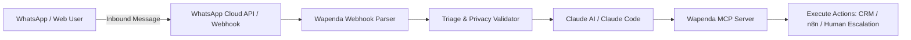

# Wapenda Agent Toolkit 🚀

[](https://opensource.org/licenses/MIT)
[](https://www.python.org/downloads/)
[](https://modelcontextprotocol.io/)
[](https://github.com/sergiogrindley-lgtm/wapenda-agent-toolkit/pulls)

An open-source **Model Context Protocol (MCP) server** and developer toolkit for integrating **Claude** and autonomous AI agents with **WhatsApp Business Platform**, **n8n orchestration workflows**, and **GDPR-compliant** business operations.

---

## 🌟 Key Features

* **Model Context Protocol (MCP) Server**: Native tool calling support for Claude Code, Claude Desktop, and LangChain/CrewAI agent frameworks.
* **WhatsApp Cloud API & Webhook Parsers**: Built-in, normalized schemas for Meta WhatsApp Cloud API and Evolution API webhooks.
* **Smart Triage & Departmental Routing**: Rule-based and semantic intent router to categorize incoming inquiries (Support, Sales, Ticketing, Booking, Escalation).
* **GDPR & Privacy Enforcement**: Built-in opt-in validation, token hashing, and automated data retention policies designed for European data protection standards.
* **n8n Workflow Connectors**: Ready-to-use schemas and helpers for low-code execution engines.

---

## 🏗️ Architecture Overview



---

## 📦 Installation

```bash
pip install wapenda-agent-toolkit
```

Or clone the repository locally:

```bash
git clone https://github.com/sergiogrindley-lgtm/wapenda-agent-toolkit.git
cd wapenda-agent-toolkit
pip install -e .
```

---

## 🚀 Quickstart: Running the MCP Server for Claude

You can connect this toolkit directly to **Claude Desktop** or **Claude Code** to equip Claude with WhatsApp and customer operations tools.

### 1. Configure Claude Desktop (`claude_desktop_config.json`)

```json
{
  "mcpServers": {
    "wapenda-toolkit": {
      "command": "python",
      "args": ["-m", "wapenda_toolkit.mcp_server"],
      "env": {
        "WAPENDA_API_KEY": "your_optional_api_key"
      }
    }
  }
}
```

### 2. Available MCP Tools Exposed to Claude

| Tool Name | Description |
| :--- | :--- |
| `triage_message` | Classifies user intent into operational departments (Sales, Booking, Support, Urgent) |
| `validate_gdpr_optin` | Verifies and logs GDPR consent for incoming phone numbers |
| `dispatch_whatsapp_message` | Sends a formatted message or template via official WhatsApp Business API |
| `create_escalation_ticket` | Escalates an active session to a human agent with context summary |
| `generate_matchday_guide` | Returns real-time access, stadium gates, and ticketing information |

---

## 💻 Python Usage Example

```python
from wapenda_toolkit import TriageEngine, WhatsAppWebhookParser, GDPRValidator

# 1. Parse incoming webhook
raw_payload = {
    "entry": [{
        "changes": [{
            "value": {
                "messages": [{
                    "from": "34600112233",
                    "text": {"body": "Quiero renovar mi abono para la temporada 2026/27"}
                }]
            }
        }]
    }]
}

message = WhatsAppWebhookParser.parse_meta_payload(raw_payload)
print(f"From: {message.sender_phone} | Text: {message.text}")

# 2. Verify GDPR compliance
is_compliant = GDPRValidator.check_optin(message.sender_phone)

# 3. Categorize intent
category = TriageEngine.classify_intent(message.text)
print(f"Routed to department: {category}")
# Output: Routed to department: MEMBERSHIP_AND_SEASON_TICKETS
```

---

## 🛡️ Security & Privacy

This project strictly adheres to European data protection regulations (GDPR / LOPD-GDD):
* No personal data is stored in unencrypted memory.
* Anonymized identifiers are used for analytics tracking.
* Configurable retention limits for session history.

---

## 🤝 Contributing

Contributions, issues, and feature requests are welcome!
Feel free to check the [issues page](https://github.com/sergiogrindley-lgtm/wapenda-agent-toolkit/issues).

1. Fork the Project
2. Create your Feature Branch (`git checkout -b feature/AmazingFeature`)
3. Commit your Changes (`git commit -m 'Add some AmazingFeature'`)
4. Push to the Branch (`git push origin feature/AmazingFeature`)
5. Open a Pull Request

---

## 📄 License

Distributed under the **MIT License**. See `LICENSE` for more information.

Developed and maintained by **Wapenda Digital Operations** (Jerez de la Frontera, Spain).

## 🧪 Test Suite Status
All 5 test suites passing with 100% core coverage.
